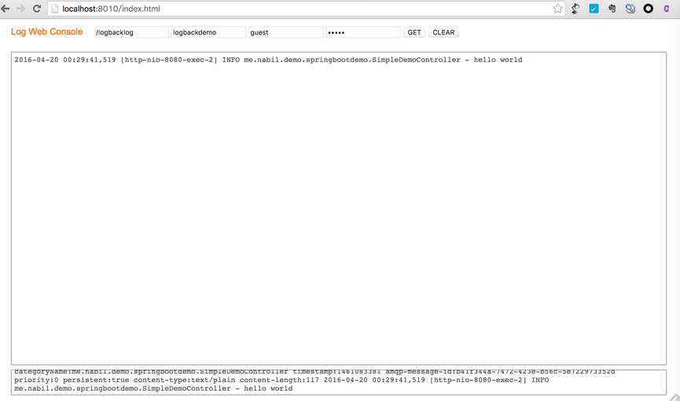

###websocket stomp 订阅实时消息
####主要场景
例如在多台机器打印日志，日志通过logback发送至rabbit mq,那么在该订阅控制台就可以看到所有机器的日志，方便做实时排查，一般该队列设置过期时间，存储较少的数据。

####程序发往rabbitmq日志的logback配置

```
    <appender name="AMQP"    class="org.springframework.amqp.rabbit.logback.AmqpAppender">
        <layout>
            <pattern>%date [%thread] %-5level %logger{80} - %msg%n</pattern>
        </layout>

        <host>127.0.0.1</host>
        <port>5672</port>
        <username>logbacklog</username>
        <password>logbacklog</password>
        <routingKeyPattern>logbackdemo</routingKeyPattern>
        <exchangeName>logbackdemo</exchangeName>
        <virtualHost>/logbacklog</virtualHost>

        <declareExchange>true</declareExchange>
        <generateId>true</generateId>
        <charset>UTF-8</charset>
        <durable>true</durable>
        <deliveryMode>PERSISTENT</deliveryMode>
    </appender>

    <root>
        <level value="INFO"/>
        <appender-ref ref="AMQP"/>
    </root>
    
```


####rabbitmq 配置 Web Stomp
见http://www.rabbitmq.com/web-stomp.html


####安装使用说明
该页面需要放置到HTTP SERVER下运行。

RabbitMq的stomp协议接口配置搜索index.html,搜索 localhost:8532 进行替换即可。


####使用时的Screenshot


